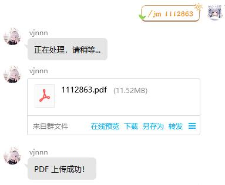

  
   
  

# nonebot_plugin_jmcomicdownload

_✨ NoneBot JMcomic下载后转换成pdf上传群文件 ✨_

## 📖 介绍

基于[Python API For JMComic](https://github.com/hect0x7/JMComic-Crawler-Python)下载本子图片到本地然后通过[image2pdf](https://github.com/salikx/image2pdf)整合成单个pdf然后上传到群文件

~因为看见了qq群转发的核心科技所以自己也想搞一个~

纯编程小白，头一次写头一次搞插件也是头一次写github文档，出了问题会尽量去修的

不知道怎么用nonebot的请看这个[文档](https://github.com/Refound-445/nonebot-plugin-nailongremove/blob/main/docs/tutorial.md)

## ⚠️ 注意事项

***人在海外肉身翻墙，不知道挂不挂代理会不会出问题，没有尝试过任何代理，如果报错请尝试代理和填写cookie***

***请保证群文件有空间上传，否则会报错***

***有一些本子是只允许登录用户查看的，如果想要查看请填写对应的cookie信息***

***图片合成pdf的这一步需要先全部转进内存然后合成pdf，没有足够内存请不要下载长篇***

## 💿 安装

使用 nb-cli 安装

在 nonebot2 项目的根目录下打开命令行, 输入以下指令即可安装

    nb plugin install nonebot_plugin_jmcomicdownload

使用包管理器安装

在 nonebot2 项目的插件目录下, 打开命令行, 根据你使用的包管理器, 输入相应的安装命令

pip

    pip install nonebot_plugin_jmcomicdownload

pdm

    pdm add nonebot_plugin_jmcomicdownload

poetry

    poetry add nonebot_plugin_jmcomicdownload

conda

    conda install nonebot_plugin_jmcomicdownload

打开 nonebot2 项目根目录下的 `pyproject.toml` 文件, 在 `[tool.nonebot]` 部分追加写入

    plugins = ["nonebot_plugin_jmcomicdownload"]

## ⚙️ 配置

在 nonebot2 项目的`config.yml`文件中添加下表中的cookie配置，

| 配置项 | 必填 | 默认值 | 说明 |
|:-----:|:----:|:----:|:----:|
| AVS | 否 | 无 | 如果不需要查看**仅登录**本子的可以不填 |
| __cflb | 否 | 无 | 如果不需要查看**仅登录**本子的可以不填 |
| cf_clearance | 否 | 无 | 如果不需要查看**仅登录**本子的可以不填 |
| base_dir | 是 | 无 | 图片下载路径，推荐放在bot的根目录下 |

## 🎉 使用
### 指令表
| 指令 | 权限 | 需要@ | 范围 | 说明 |
|:-----:|:----:|:----:|:----:|:----:|
| /jm | 群员 | 否 | 群聊 | 空一格后输入神秘数字即可 |

### 效果图

## 🙏 鸣谢

- [Python API For JMComic](https://github.com/hect0x7/JMComic-Crawler-Python) - jm的API以及图片下载方式
- [image2pdf](https://github.com/salikx/image2pdf) - 图片整合pdf
- [NoneBot2](https://github.com/nonebot/nonebot2) - 跨平台 Python 异步机器人框架

